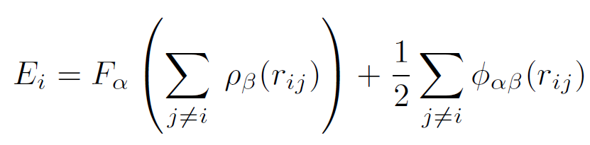
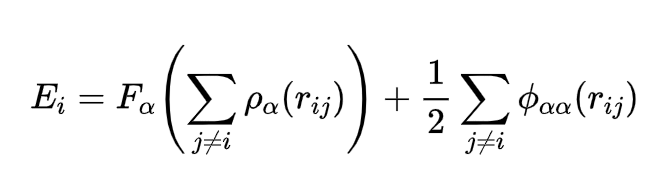
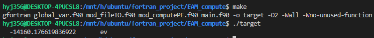
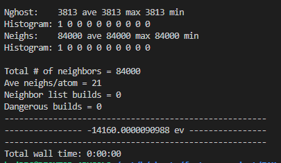

# 关于田老师的EAM教程的一点代码补充

​		首先我们来看看EAM势能的基本公式:



​		上述公式的形式非常简单, 但是其实上述公式是eam/alloy的形式, 为了更简单, 我们可以将公式进一步简化为最基本的eam形式, 改动不大, 只需要把所有β都改成α即可, 因为eam的势函数只能用于单一金属元素的MD, 计算过程中不可能出现α和β两种不同的元素. 简化之后的公式如下:



​		这里我展示一下对应的标准格式的模型文件里面的前20行, 务必按照这样的格式导出模型文件, 包括连空行都要保持一致, 上述程序才能读取成功:

```
 # Fcc Cu oriented X=[100] Y=[010] Z=[001].
 
        4000  atoms
           1  atom types
 
      0.000000000000      36.150000000000  xlo xhi
      0.000000000000      36.150000000000  ylo yhi
      0.000000000000      36.150000000000  zlo zhi
 
Masses
 
            1   63.54600000             # Cu
 
Atoms # atomic
 
         1    1        0.000000000000       0.000000000000       0.000000000000
         2    1        1.807500000000       1.807500000000       0.000000000000
         3    1        0.000000000000       1.807500000000       1.807500000000
         4    1        1.807500000000       0.000000000000       1.807500000000
         5    1        3.615000000000       0.000000000000       0.000000000000
```


# 主程序代码示范

```fortran
program main
  use global_var, only: wp, stdout
  use fileIO, only: eamFile, Readfile, Atom, ReadData, region
  use computeUE, only: Pair, interpolate, Energy
  implicit none
  type(eamFile) :: cu_u3                !< 包含势函数的数据和处理之后的数据的类
  type(Atom), allocatable :: cuSC(:)    !< 单晶Cu的模型文件
  type(region)  :: box                  !< 仿真盒子
  real(wp) :: power

  call Readfile('Cu_u3.eam', cu_u3)
  call ReadData('cu.lmp', box, cuSC)
  call Energy(cu_u3, cuSC, power, box)    !! 根据势函数和模型文件计算势能

  write(stdout, *) power, ' ev'           !! 输出势能
  ! lammps的输出: -14160.0000090988 ev

end program main
```

​		其中**Cu_u3.eam**是lammps的文件夹中自带的势函数文件, 而**cu.lmp**是我用ATOMSK生成的一个含有4000个Cu原子, 且xyz取向为标准取向的原子模型, 相关文件和源代码会在文章最后一并给出.

​		进入src目录输入make即可完成编译工作, 使用gfortran或者ifort都可以

​		自编程运行结果:



​		lammps测试in文件:

```python
# 基本设定
units metal
boundary p p p
timestep        0.001
neighbor 0.0 bin          # neigbor设为0.0, 只计算截断半径以内的原子的势能
read_data cu.lmp 

# 定义势函数
pair_style eam
pair_coeff * * Cu_u3.eam        # 定义原子为Cu
# 定义势能并输出
variable pot equal pe
thermo 100
thermo_style custom step pe ke etotal epair
run 0
print "------------------------------------------------------" 
print "---------------- ${pot} ev ----------------" 
print "------------------------------------------------------"
```

​		lammps运行结果:



​		可以看到, 从相对误差的角度来说, 误差小于万分之一.


